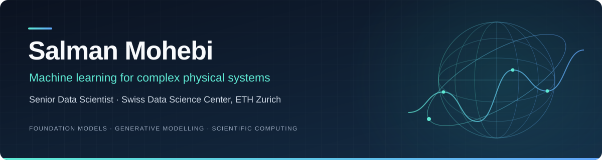

**Scientific machine learning · Foundation models · Generative modelling**

<a href="https://www.linkedin.com/in/salman-mohebi/" title="LinkedIn profile"> LinkedIn</a>
&nbsp;·&nbsp;
<a href="https://scholar.google.com/citations?user=sRxnw0MAAAAJ" title="Publications on Google Scholar"> Google Scholar</a>
&nbsp;·&nbsp;
<a href="https://huggingface.co/salmanmohebi" title="Hugging Face profile"> Hugging Face</a>
&nbsp;·&nbsp;
<a href="mailto:s.mohebi22@gmail.com" title="Email Salman"> Email</a>

## From scientific questions to scalable models

I'm **Salman Mohebi**, a **Senior Data Scientist at the Swiss Data Science Center (SDSC), ETH Zurich**. I develop machine learning methods for complex physical systems: learning across Earth-system datasets, generating seismic ground motions, and modelling physical processes within numerical simulations.

My work connects **model development, scientific evaluation, and ML engineering**. I build reproducible training and inference pipelines, scale experiments across GPU clusters, and collaborate with scientists to evaluate models in the workflows where they will be used.

> **Research focus:** foundation models, diffusion and rectified flow, physics-informed learning, and efficient training at scale.

## Selected research & open-source work

<table>
<tr>
<td width="50%" valign="top">

EARTH-SYSTEM FORECASTING · FOUNDATION MODELS

<h3>ESFM</h3>

<strong>Learning across observations and simulations.</strong>

I co-develop the Earth System Foundation Model through the Swiss AI Initiative, integrating heterogeneous scientific data for weather and climate forecasting.

My work includes distributed GPU training and reproducible experimentation.

<a href="https://github.com/swiss-ai/ESFM" title="ESFM source code on GitHub"> Code</a>
&nbsp;·&nbsp;
<a href="https://arxiv.org/abs/2605.00850" title="ESFM preprint on arXiv"> Preprint</a>

</td>
<td width="50%" valign="top">

SEISMOLOGY · GENERATIVE MODELLING

<h3>HighFEM / TQDNEs</h3>

<strong>Generating spatially correlated ground motions.</strong>

I develop latent diffusion and rectified-flow models for earthquake ground-motion generation, working with earthquake scientists at ETH Zurich on seismic hazard estimation.

TQDNEs includes source code and released inference checkpoints.

<a href="https://github.com/highfem/tqdnes" title="TQDNEs source code on GitHub"> Code</a>
&nbsp;·&nbsp;
<a href="https://huggingface.co/salmanmohebi/tqdnes" title="TQDNEs model checkpoints on Hugging Face"> Models</a>
&nbsp;·&nbsp;
<a href="https://www.datascience.ch/projects/highfem" title="HighFEM project at SDSC"> Project</a>

</td>
</tr>
<tr>
<td width="50%" valign="top">

ATMOSPHERIC PHYSICS · PHYSICS-INFORMED ML

<h3>piDLRad / DeepCloud</h3>

<strong>Learning radiation physics for numerical models.</strong>

I developed a physics-informed surrogate for radiation modelling and evaluated its accuracy and stability within weather and climate simulations.

Research outputs include open-source code, a JAMES paper, and an ICON simulation dataset.

<a href="https://github.com/SwissDataScienceCenter/deepcloud-pidlrad" title="piDLRad source code on GitHub"> Code</a>
&nbsp;·&nbsp;
<a href="https://doi.org/10.1029/2025MS004956" title="piDLRad research paper"> Paper</a>
&nbsp;·&nbsp;
<a href="https://doi.org/10.3929/ethz-b-000721647" title="ICON simulation dataset"> Dataset</a>

</td>
<td width="50%" valign="top">

CLIMATE DOWNSCALING · ECOLOGICAL DATA

<h3>ECOCLIM</h3>

<strong>Bringing ecological information into climate downscaling.</strong>

I work on climate downscaling informed by ecological data, in collaboration with WSL and the University of Bern.

<!-- ECOCLIM: paste your project URL into the empty href below when ready. -->

<a href="" title="ECOCLIM project"> Project</a>

</td>
</tr>
</table>

## How I work

- **Model with scientific context.** Combine heterogeneous data and physical structure with modern ML methods.
- **Evaluate beyond standalone predictions.** Compare against established baselines and assess accuracy, efficiency, and stability within numerical simulations.
- **Make experiments reproducible.** Build research software and training pipelines that support benchmarking, collaboration, and reuse.
- **Scale with care.** Use distributed training, profiling, and quantisation to address computational bottlenecks.

## Technical toolkit

| Area | Methods & tools |
| :--- | :--- |
| **Models** | Transformers, diffusion, rectified flow, physics-informed learning, clustering, optimisation |
| **Distributed training** | PyTorch DDP & FSDP, multi-node GPUs, mixed precision, activation checkpointing, Slurm |
| **Model efficiency** | Post-training quantisation, model compression, NVIDIA Nsight, performance profiling |
| **Scientific data** | NumPy, SciPy, xarray, Dask, NetCDF, Zarr, HDF5 |
| **Research engineering** | PyTorch Lightning, Git, Docker, Kubernetes, reproducible training and inference pipelines |

## Background & mentorship

**PhD in Information Engineering · University of Padova**  
**Marie Skłodowska-Curie Fellow · EU Horizon 2020, WindMill**

I have worked in machine learning since **2017**, across NLP, computer vision, wireless networks, and scientific computing. I joined SDSC as a postdoctoral researcher in **2023** and became a Senior Data Scientist in **2025**. Alongside research and engineering, I mentor junior data scientists and supervise MSc theses and projects.

<strong>Earlier research & experience</strong>

- **University of Padova:** optimisation, clustering, and resource allocation for wireless networks during my PhD.
- **Telenor Research:** a doctoral research visit studying measurements from a commercial 5G mmWave network.
- **Kavosh:** machine learning solutions for NLP and computer vision, including medical text classification and document analysis.
- **University of Tehran:** research on scheduling and optimisation for M2M and IoT communication.

---

### Connect

I enjoy working across disciplines on scientific ML and reproducible research software.

<a href="https://www.linkedin.com/in/salman-mohebi/" title="LinkedIn profile"> LinkedIn</a>
&nbsp;·&nbsp;
<a href="https://scholar.google.com/citations?user=sRxnw0MAAAAJ" title="Publications on Google Scholar"> Google Scholar</a>
&nbsp;·&nbsp;
<a href="https://huggingface.co/salmanmohebi" title="Hugging Face profile"> Hugging Face</a>
&nbsp;·&nbsp;
<a href="mailto:s.mohebi22@gmail.com" title="Email Salman"> Email</a>

Zurich, Switzerland

